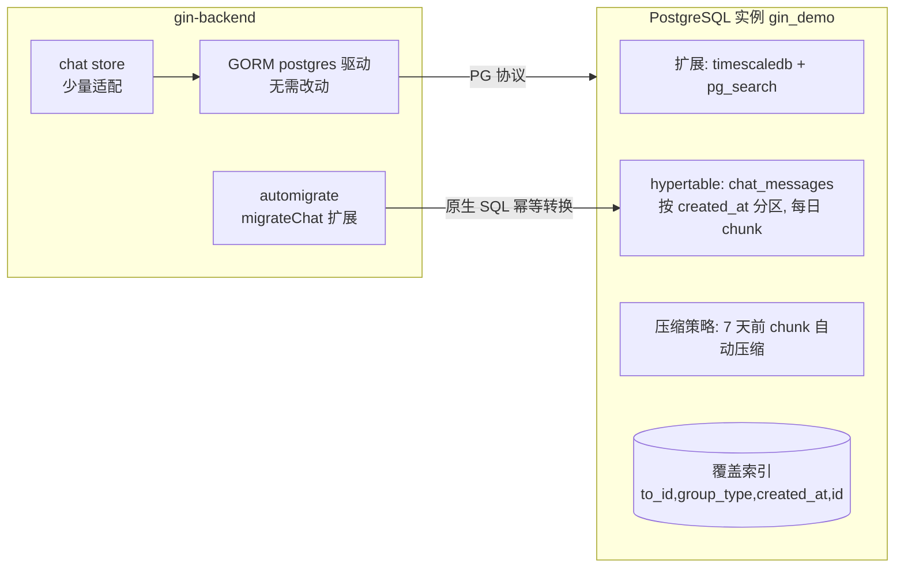
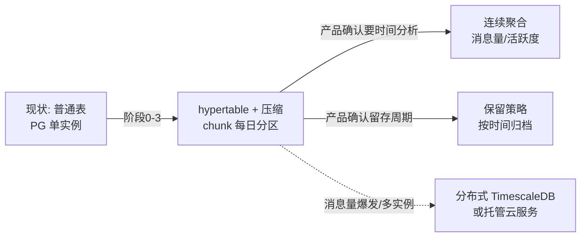

# chat 模块引入 TimescaleDB 改造方案

> 定位：基于 PostgreSQL 生态的最小侵入改造。TimescaleDB 是 PostgreSQL 扩展，**兼容 PG 协议**，
> 现有 `gorm.io/driver/postgres` 驱动与 `PostgreSQLManager` 连接框架**无需改动**，
> 改造集中在：部署层（扩展安装）、`chat_messages` 表结构（hypertable 转换）、迁移工具、少量查询适配。
>
> 决策背景（2026-08-15 讨论）：chat 消息是"带时间戳的结构化事件流"，具备时序特征；
> 现阶段以"低成本期权"方式落地——schema 设计为可平滑迁移 hypertable，为未来的时间维度查询/分析预留能力，
> 而不承诺引入完整时序分析栈。

---

## 1. 现状盘点

| 项 | 现状 | 来源 |
| --- | --- | --- |
| 连接 | 单实例 PostgreSQL `gin_demo`，`PostgreSQLManager` 注册模式（ServiceAuth/ServiceMarkdown），chat 复用 ServiceMarkdown | `internal/common/base/connection/postgresql/` |
| 驱动 | `gorm.io/driver/postgres v1.6.2` + `gorm.io/gorm v1.31.2` | `gin-backend/go.mod` |
| 消息表 | `chat_messages`：`id`(PK 自增)、`group_type`、`from_id`、`to_id`(复合索引)、`payload`(text)、`created_at`/`updated_at`(int64)、`deleted_at`(gorm.DeletedAt 软删) | `internal/model/orm/chat/message.go` |
| 读路径 | `FetchOffline`（to_id+private, `ORDER BY id ASC LIMIT 100`）；`FetchGroupHistory`（to_id+group, `ORDER BY id DESC LIMIT 100` 反转） | `internal/service/chat/store/message.go` |
| 写路径 | 投递热路径同步 `Save`（INSERT） | `structure/bridge/deliver.go` |
| 迁移工具 | `utils/automigrate`，`migrateChat` 仅 `AutoMigrate` 三张表 | `utils/automigrate/automigrate.go` |
| 部署 | `deployments/postgresql/sql/plugin/pg_search_setup.sql`（ParadeDB pg_search 扩展模式） | 仓库 |

---

## 2. 目标架构



改造后收益：

- **分区裁剪**：`FetchGroupHistory`/`FetchOffline` 只扫描命中的 chunk，历史越长优势越大；
- **自动压缩**：7 天前的 chunk 压缩（segmentby=to_id），历史消息存储成本大幅下降，查询仍走压缩感知索引；
- **保留/归档**（可选，默认关闭）：`add_retention_policy` 按时间淘汰，或保留全量（业务默认）；
- **未来能力**：`time_bucket` 连续聚合（消息量/活跃度/峰值时段分析）随时可用。

---

## 3. 分阶段实施

### 阶段 0：部署层（扩展安装）

TimescaleDB 要求 `shared_preload_libraries` 含 `timescaledb`，且扩展二进制已安装。根目录的 `docket-compose.yaml` 已设置此参数；其他部署方式可按实际环境三选一：

**方式 A（推荐）：基于 timescale 官方镜像 + 装 pg_search**

```dockerfile
# Dockerfile（示例, 版本需与 pg_search 支持矩阵匹配）
FROM timescale/timescaledb:2.17.2-pg17
# 安装 ParadeDB pg_search（其提供 .deb 包, 需 apt 源, 见 ParadeDB 文档）
# RUN ... 安装 pg_search ...
CMD ["postgres", "-c", "shared_preload_libraries=timescaledb,pg_search"]
```

**方式 B：继续用 paradedb/paradedb 镜像 + 装 timescaledb**

```dockerfile
FROM paradedb/paradedb:latest
# 安装 timescaledb（Timescale 提供 apt 源, 见 TimescaleDB 文档）
# RUN ... 安装 timescaledb ...
CMD ["postgres", "-c", "shared_preload_libraries=pg_search,timescaledb"]
```

**方式 C：本地自装 PG**：编译安装 timescaledb 与 pg_search，`postgresql.conf` 追加 `shared_preload_libraries = 'timescaledb,pg_search'` 后重启。

> 无论哪种方式，**pg_search（markdown 全文检索）必须保留**，仅新增 timescaledb，二者可共存。

### 阶段 1：`chat_messages` 转 hypertable（核心）

依次执行插件与业务配置脚本：`deployments/postgresql/sql/plugin/timescaledb_setup.sql`、`deployments/postgresql/sql/service/chat/timescaledb_setup.sql`

关键决策与步骤：

**① 时间列选择：保留 `created_at`（bigint, Unix 秒）**

- TimescaleDB 官方支持整数时间列，`created_at` 由 GORM `autoCreateTime` 写入，**模型零类型变更**；
- 备选 `timestamptz` 更符合时序习惯，但需把模型 `int64 → time.Time`，波及 JSON 序列化、store 转换、缓存 DTO，侵入大，不推荐现阶段做；
- chunk 间隔：`86400`（1 天），按消息量可调（目标每个 chunk 数百万行）。

**② 主键冲突（本方案最关键点）**
TimescaleDB 强制：hypertable 的 `PRIMARY KEY`/`UNIQUE` 必须包含分区列。当前 `id` 单键主键**不满足**，直接 `create_hypertable` 会报错。
解决：重建为复合主键 `(created_at, id)`（脚本第 2 步幂等处理，兼容"新表已复合键"与"旧表单键"两种情况）。

**③ 转换**

```sql
SELECT create_hypertable('chat_messages',
       by_range('created_at', 86400),
       if_not_exists => TRUE, migrate_data => TRUE);
```

- `migrate_data => TRUE`：已有数据搬入（转换期间持锁，大表低峰执行 + 先备份）；
- `if_not_exists => TRUE`：重复执行幂等。

**④ 覆盖索引**

```sql
CREATE INDEX IF NOT EXISTS idx_message_to_type_time
  ON chat_messages (to_id, group_type, created_at DESC, id DESC);
```

分区裁剪后，群历史/离线拉取在 chunk 内索引扫描即完成排序，无需回表。

### 阶段 2：代码适配（Go）

| 文件 | 改动 | 说明 |
| --- | --- | --- |
| `internal/model/orm/chat/message.go` | 拆出 `TimeFiled`，`CreatedAt` 加 `gorm:"primaryKey"`（复合主键 `(id, created_at)`） | **不要改全局 `orm.TimeFiled`**（users/markdowns/groups 等会全变复合主键）；chat 模型独立声明字段 |
| `internal/service/chat/store/message.go` `DeleteByIDs` | `Delete(&Message{}, ids)` → `Where("id IN ?", ids).Delete(&Message{})` | 复合主键下 GORM 不再支持按单主键 slice 删除 |
| `internal/service/chat/store/message.go` 读路径 | **可选**：`Order("id DESC")` → `Order("created_at DESC, id DESC")` | `id` 与 `created_at` 在单进程写入下单调一致，当前不改也正确；显式对齐时间列可消除跨时钟漂移/批量导入的不一致隐患 |
| `Save`/`FetchOffline`/`FetchGroupHistory` | 无需改动 | SQL 语义不变，仅执行计划受益于分区裁剪 |

> 其余表（`chat_groups`、`chat_group_members`）**不转 hypertable**——它们是低写入的成员关系数据，无时序特征，保持普通表。

### 阶段 3：压缩策略（可选但推荐）

脚本第 5 步已含：

```sql
ALTER TABLE chat_messages SET (
  timescaledb.compress,
  timescaledb.compress_segmentby = 'to_id',       -- 仅允许低基数列
  timescaledb.compress_orderby   = 'created_at DESC'
);
SELECT add_compression_policy('chat_messages', INTERVAL '7 days', if_not_exists => TRUE);
```

- `segmentby` 只能用低基数列；`to_id`（用户/群 ID）合适，`payload` 等高基数/变长列不允许；
- 压缩后旧 chunk 查询走压缩感知索引，行为对上层透明。

### 阶段 4：连续聚合（未来可选）

消息量/活跃度分析就绪（需要时再启用，当前不建）：

```sql
CREATE MATERIALIZED VIEW messages_hourly
WITH (timescaledb.continuous) AS
SELECT to_id, time_bucket(86400, created_at) AS bucket, count(*)
  FROM chat_messages
 GROUP BY to_id, bucket
WITH NO DATA;
```

配合 `add_continuous_aggregate_policy` 自动刷新。

---

## 4. 迁移工具改造（`utils/automigrate`）

`migrateChat` 改为三步骤（参考代码，**本方案不直接实施**）：

```go
func migrateChat(conf *config.Config) error {
    db, err := postgresqlconn.PostgreSQLManager.RegisterAndGet(
        connection.ServiceMarkdown, conf.PostgresConfig, conf.LogConfig.Level)
    if err != nil { return err }
    defer postgresqlconn.PostgreSQLManager.Unregister(connection.ServiceMarkdown)

    // 1. 建表 (幂等; 新环境建出普通表, 旧环境跳过)
    if err := postgresqlconn.AutoMigrate(db,
        &chatmodel.Group{}, &chatmodel.GroupMember{}, &chatmodel.Message{}); err != nil {
        return err
    }

    // 2. 检查 timescaledb 扩展是否可用
    var ext string
    if err := db.Raw(`SELECT extname FROM pg_extension WHERE extname = 'timescaledb'`).
        Scan(&ext).Error; err != nil {
        return err
    }
    if ext == "" {
        slog.Warn("timescaledb 扩展未安装, chat_messages 保持普通表 (时序能力降级)")
        return nil // 优雅降级: 不阻塞建表
    }

    // 3. 幂等执行 hypertable 转换 (等价 service/chat_timescaledb_setup.sql 第 1-4 步)
    //    建议 go:embed 内嵌 SQL 脚本, 或直接内联执行
    if err := ensureHypertable(db); err != nil {
        return fmt.Errorf("chat_messages 转 hypertable 失败: %w", err)
    }
    return nil
}
```

要点：

- **扩展缺失时优雅降级**：仅警告并跳过转换，服务仍可运行（普通表语义不变），避免部署升级与代码发布耦合；
- **幂等**：`create_hypertable if_not_exists` + `CREATE INDEX IF NOT EXISTS` + 主键重建的 `DO` 块；
- 执行顺序：**先 `AutoMigrate` 建表，再转 hypertable**（新环境依赖此顺序）。

---

## 5. 回滚方案

| 场景 | 操作 |
| --- | --- |
| 扩展未装/转换失败 | 普通表语义不变，直接回滚代码，无影响 |
| 需要撤销 hypertable | ①停服务 → ②备份 → ③`ALTER TABLE chat_messages SET (timescaledb.compress = 'off')`（若已压缩）→ ④用 `pg_dump` 导出/新建普通表导入 → ⑤删除 hypertable |
| 压缩策略关闭 | `SELECT remove_compression_policy('chat_messages', if_exists => TRUE)` |
| 主键重建影响业务 | 复合主键 `(created_at, id)` 对查询透明；若需回退单键主键，先转回普通表再重建 |

> TimescaleDB 是 PG 扩展，不存在"数据被困在私有存储"的问题——`pg_dump`/`psql` 全套工具照常可用，这是相比 MongoDB 的核心回滚优势。

---

## 6. 风险与注意事项

1. **转换锁表**：`migrate_data => TRUE` 在数据量较大时持锁；上线窗口选低峰，先备份。
2. **复合主键与 GORM**：`DeleteByIDs` 必须改 `Where("id IN ?")`；全仓 grep 确认无其他按 `id` 单主键操作 `chat_messages` 的路径。
3. **`ORDER BY id` vs 时间列**：当前查询按 `id` 排序；单进程写入下与 `created_at` 单调一致，但**批量导入/多实例写入**可能破坏该假设——建议读路径显式 `ORDER BY created_at DESC, id DESC`（阶段 2 已列）。
4. **AutoMigrate 与 hypertable 交互**：GORM 不感知 hypertable；若模型主键 tag 与表不一致，`AutoMigrate` 可能尝试改表——保持模型 tag 与"已转换表"一致（复合主键），并避免在 hypertable 上跑会重建表结构的迁移。
5. **版本兼容**：`by_range`/`if_not_exists` 参数需 TimescaleDB 2.13+；压缩策略 `if_not_exists` 需 2.13+。脚本已注明旧版本等价写法。
6. **扩展共存**：pg_search 必须保留，`shared_preload_libraries` 顺序无严格要求，但需在同一个 PG 实例中同时加载。

---

## 7. 验证清单

- [ ] `SELECT extversion FROM pg_extension WHERE extname='timescaledb';` 有版本号
- [ ] `timescaledb_information.hypertables` 含 `chat_messages`
- [ ] `EXPLAIN ANALYZE` 群历史查询：仅扫描命中的 chunk，走 `idx_message_to_type_time`，无回表排序
- [ ] 发私聊消息 → 断线重连 → 离线补发正常（软删 `deleted_at` 语义不变）
- [ ] 私聊与群聊均从 pending delivery 重放，群历史窗口不会重复补发
- [ ] `DeleteByIDs` 软删正常（复合主键适配后）
- [ ] 压缩策略生效：7 天后旧 chunk `compression_status = 'Compressed'`
- [ ] `automigrate -only chat` 重复执行幂等（第二次无报错）

---

## 8. 演进路径（低成本期权）



- 阶段 1-3 是**纯增强**（查询更快、存储更省），不改变任何对外语义，可随时灰度；
- 连续聚合/保留策略是**新功能决策**，由产品需求驱动（呼应此前讨论：选型不应倒果为因）；
- 若未来数据规模超出单实例，TimescaleDB 支持多节点/托管云，迁移路径平滑。

---

*配套文件：`deployments/postgresql/sql/plugin/timescaledb_setup.sql`（插件安装）与 `deployments/postgresql/sql/service/chat/timescaledb_setup.sql`（幂等业务配置）*
