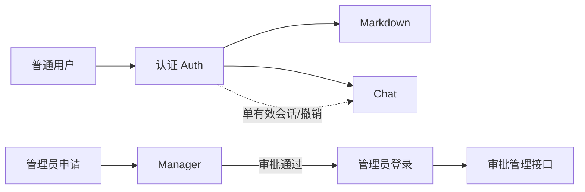
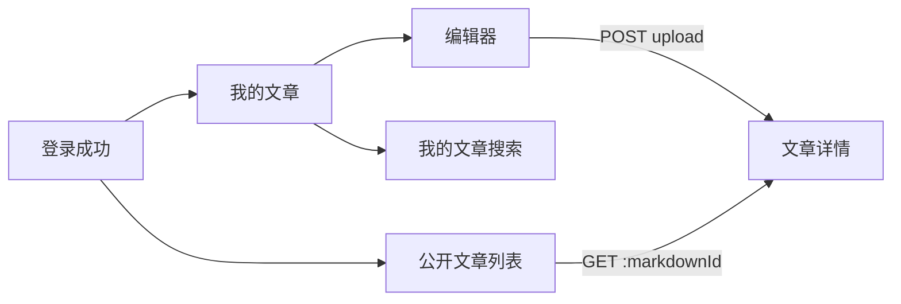

# gin-backend 前端 API 集成说明

> **读者**：`simple-frontend` 的页面、状态管理和请求层开发者。  
> **范围**：以当前已启动的 `gin-backend` 实现为准，而不是规划中的接口。  
> **开发环境基地址**：`http://127.0.0.1:8080`。

## 1. 先建立整体认知

### 1.1 业务模块与前端入口



| 模块 | 前端职责 | 前置条件 | 关键关系 |
| --- | --- | --- | --- |
| Auth | 注册、登录、刷新令牌、登出 | 无 | 普通用户的所有业务接口均依赖它 |
| Markdown | 创建、我的文章、公开阅读、搜索 | 普通用户会话 Cookie | 文章作者来自会话，不由页面传入 |
| Chat | 建立收消息通道、发送消息、群成员操作 | 普通用户会话 Cookie | 新登录/登出会使旧会话的连接失效 |
| Manager | 管理员申请、登录及申请审批 | 管理员会话 Cookie | 管理员注册不是立即可登录，必须先审批 |

### 1.2 路径、鉴权与统一响应

- 所有业务路径以 `/api/v1` 开头；文中示例均省略基地址。
- 公开接口：`/api/v1/public/**`，不带令牌。
- 普通用户保护接口：`/api/v1/protected/**`，由 `pp_user_at` HttpOnly Cookie 鉴权。
- 管理员保护接口也在 `/api/v1/protected/**`，由 `pp_manager_at` HttpOnly Cookie 鉴权。
- 除健康检查与 `204` 投递确认外，HTTP JSON 响应使用下列包装：

```ts
type ApiSuccess<T> = {
  success: true;
  data: T;
  meta?: { page: number; per_page: number; total: number; total_pages: number };
};

type ApiFailure = {
  success: false;
  error: { code: string; message: string };
};
```

所有浏览器请求均应使用 `credentials: 'include'`。受保护写接口和 refresh 接口还必须携带 CSRF Header：

```http
Content-Type: application/json
X-CSRF-Token: <对应 pp_*_csrf Cookie 的值>
```

### 1.3 状态码与页面处理

| 状态 | 含义 | 前端默认动作 |
| --- | --- | --- |
| `200` | 查询/动作成功 | 使用 `data` 更新页面 |
| `201` | 创建成功 | 写入新对象或跳转详情 |
| `204` | 无响应体的成功 | 不再解析 JSON |
| `400` | 参数或消息格式错误 | 就地展示 `error.message` |
| `401` | 未登录、令牌过期、refresh 重放、会话被替换 | 见“令牌生命周期”；无法恢复时清空本地会话并回登录页 |
| `403` | 已登录但权限不足 | 展示无权访问，不要反复刷新 token |
| `404` | 资源、群、投递或申请单不存在 | 展示不存在/已删除 |
| `409` | 重复注册或重复审批 | 刷新当前数据，提示冲突 |
| `503` | PostgreSQL、Redis 或聊天服务未就绪 | 可重试并显示服务暂不可用 |

常见 `error.code`：`VALIDATION_FAILED`、`PARSE_ERROR`、`UNAUTHORIZED`、`FORBIDDEN`、`NOT_FOUND`、`CONFLICT`、`SERVICE_UNAVAILABLE`、`INTERNAL_ERROR`。前端应以 HTTP 状态驱动流程，以 `message` 作为可展示文本；不要依赖未枚举的中文文案作逻辑分支。

### 1.4 时间与分页约定

- `created_at`、`updated_at` 是 **Unix 秒**，不是 ISO 字符串；显示前乘以 `1000`：`new Date(created_at * 1000)`。
- 分页查询使用 `page`（从 1 起）和 `pageSize`（1–100）。响应 `meta.per_page` 使用蛇形命名。
- Markdown、用户、管理员的内部自增 `id` 与对外 Markdown `markdownId` 不同；文章路由只使用 `markdownId`。

## 2. 令牌与单有效会话（所有模块共用）

登录和刷新会通过 `Set-Cookie` 写入 HttpOnly access/refresh JWT；响应 `data` 仅返回成功消息，不包含 JWT，也不支持 `Authorization: Bearer`。

服务端为每个用户（普通用户、管理员各自独立）只保留一个当前 `sid` 会话。因此：

1. 登录成功后覆盖本账号旧会话；旧设备对应的 Cookie 会话立即不可用。
2. refresh 成功后，服务端原子轮换两枚 Cookie 中的 JWT；旧 refresh JWT 不可重放。
3. 调用 logout 后，当前 Cookie 会话立即失效并由服务端清理。
4. 当收到 `401` 时，只允许对普通请求尝试一次 Cookie refresh；refresh 也为 `401`，或重放后的请求仍为 `401`，必须清除前端展示会话并跳转登录页。

推荐的请求层伪代码：

```ts
async function requestWithSession(input: RequestInfo, init: RequestInit = {}) {
  const response = await fetch(input, { ...init, credentials: 'include' });
  if (response.status !== 401) return response;

  // 用单飞锁保证多个并发 401 只触发一次 refresh。
  const refreshed = await refreshTokenPairOnce();
  if (!refreshed) {
    clearUserSession();
    redirectToLogin();
    throw new Error('session expired');
  }
  return fetch(input, { ...init, credentials: 'include' });
}
```

不要把 JWT 放在 URL、日志、错误上报内容或消息载荷中；浏览器应只通过 HttpOnly Cookie 发送它们。

## 3. Auth：普通用户认证

### `POST /api/v1/public/auth/register`

创建普通用户；成功后**不会自动登录**，前端应显式调用 login。

```json
// request
{ "email": "alice@example.com", "password": "at-least-6-chars", "nickname": "alice" }

// 201 data（密码不会返回）
{ "id": 1, "email": "alice@example.com", "nickname": "alice", "avatar": "", "banned": false, "created_at": 0, "updated_at": 0, "deleted_at": null }
```

约束：`email` 合法；`password` 6–128 字符；`nickname` 3–32 字符。重复邮箱返回 `409`。

### `POST /api/v1/public/auth/login`

```json
// request
{ "email": "alice@example.com", "password": "at-least-6-chars" }
```

成功后响应写入用户 access、refresh 与 CSRF Cookie，`data` 为登录成功消息。错误密码、用户不存在或账号不可用均按 `401` 处理，页面不要据此区分用户是否存在。

### `POST /api/v1/public/auth/refresh`

浏览器自动携带 `pp_user_rt`，请求还必须带 `X-CSRF-Token`。成功后服务端覆盖 Cookie；此接口本身是公开路径，但并不代表无认证；缺少或无效 refresh Cookie 返回 `401`。

### `POST /api/v1/protected/auth/logout`

浏览器自动携带普通用户 access Cookie，且请求必须携带 `X-CSRF-Token`。成功返回：

```json
{ "success": true, "data": { "message": "登出成功" } }
```

无论请求是否成功，前端的“退出登录”操作都应最终清除本地令牌和聊天连接。

## 4. Markdown：文章文本管理

> 这里的“上传”是创建 Markdown **文本内容**的 JSON 请求，不是 `multipart/form-data` 文件上传，也不接收文件二进制。前端编辑器应传递 `content` 字符串。

### 数据对象

```ts
type MarkdownSummary = {
  id: number;
  markdown_id: string;
  author_id: string;
  title: string;
  summary: string;
  visibility: 'public' | 'private';
  created_at: number;
  updated_at: number;
  deleted_at: string | null;
};
```

创建和详情使用驼峰字段，列表直接返回持久化对象的蛇形字段；这是当前实现的既有契约，前端建议在 API adapter 中归一化，而不是让页面混用两种命名。

### `POST /api/v1/protected/markdown/upload`

创建文章。作者身份由 access Cookie 会话决定，**不要**提交 `authorId`。

```json
// request
{ "title": "第一篇", "content": "# Markdown 正文", "visibility": "public" }

// 201 data
{
  "markdownId": "uuid",
  "title": "第一篇",
  "summary": "# Markdown 正文",
  "visibility": "public",
  "createdAt": 0,
  "updatedAt": 0
}
```

`visibility` 省略时为 `private`；可选值仅 `public`、`private`。标题 1–255 字符，正文不能为空。

### `GET /api/v1/protected/markdown/mine?page=1&pageSize=10`

当前用户自己的文章摘要列表，包含公开和私有文章。成功 `data.markdownList` 为 `MarkdownSummary[]`，同时返回分页 `meta`。

### `GET /api/v1/protected/markdown/public?page=1&pageSize=10`

所有已登录用户可见的公开文章摘要列表；仍需要普通用户 token。响应结构同“我的文章”。

### `GET /api/v1/protected/markdown/:markdownId`

获取文章完整正文。公开文章任意登录用户可读；私有文章只有作者可读，其他用户收到 `403`。

```json
// 200 data
{
  "markdownId": "uuid",
  "title": "第一篇",
  "summary": "...",
  "visibility": "public",
  "content": "# Markdown 正文",
  "createdAt": 0,
  "updatedAt": 0
}
```

### `GET /api/v1/protected/markdown/search?keyword=关键词&page=1&pageSize=10`

仅搜索当前用户自己的标题、摘要和正文，返回摘要列表与分页 `meta`。`keyword` 必填，空白值为 `400`。它不是公开文章的全站搜索。

### 页面流转



## 5. Chat：连接、消息与群

### 5.1 先选传输方式

| 能力 | WebSocket `GET /api/v1/protected/chat/ws` | SSE `GET /api/v1/protected/chat/sse` + HTTP POST |
| --- | --- | --- |
| 收消息 | 双向帧通道 | 单向事件流 |
| 发消息 | 支持消息 wire JSON | `POST /api/v1/protected/chat/messages`（或兼容别名 `/api/v1/protected/chat/sse/messages`） |
| 断线行为 | 服务端 ping/pong；旧会话会被关闭 | 事件流断开；旧会话会被关闭 |
| 浏览器直接可用性 | 可用：浏览器自动携带 HttpOnly access Cookie | 可用：`new EventSource(url, { withCredentials: true })` |

**当前浏览器契约**：两个连接入口会从 HttpOnly Cookie `pp_user_at` 读取 access JWT；浏览器原生 WebSocket/SSE 会在握手中自动携带该 Cookie。后端不接受 Bearer 凭据，前端不应将 JWT 传入 URL、`Sec-WebSocket-Protocol` 或尝试为原生对象设置 Authorization。

Cookie 鉴权的 HTTP 写操作需要 `X-CSRF-Token`；详细迁移步骤、Cookie 作用域和错误处理见 [httpOnlyCookieMigration.md](./httpOnlyCookieMigration.md)。

### 5.2 消息 wire 格式

`POST /api/v1/protected/chat/messages` 和 `/sse/messages` 的 body：

```json
{
  "metadata": {
    "type": "text",
    "groupType": "private",
    "to": "接收用户 ID"
  },
  "content": "你好"
}
```

| 字段 | 要求 | 说明 |
| --- | --- | --- |
| `metadata.type` | 固定 `text` | 其他类型为 `400` |
| `metadata.groupType` | `private` 或 `group` | private 的 `to` 是用户 ID；group 的 `to` 是群 ID |
| `metadata.to` | 必填 | 不可为空 |
| `metadata.from`、`timestamp` | 客户端不要传或视为无效 | 服务端从 token 覆盖 sender，并写入服务端时间 |
| `content` | 非空，最多 48 KiB | 整个 HTTP 请求体上限为 64 KiB |

成功响应：

```json
{ "success": true, "data": { "message": "消息已接受", "deliveryIds": ["uuid"] } }
```

`deliveryIds` 是每个接收者的专属投递 ID；群消息可能返回多个 ID。群发送者必须已经是群成员，否则 `403`。

SSE 收到的帧如下，事件名为 `text`；`id` 对应 delivery ID：

```text
id: <deliveryId>
event: text
data: {"metadata":{"deliveryId":"...","type":"text","groupType":"private","from":"1","to":"2","timestamp":0},"content":"你好"}
```

当前实现会读取 `Last-Event-ID`，但持久化补发尚未实现；不能把它当作可靠断点续传。

### 5.3 投递确认

`POST /api/v1/protected/chat/deliveries/:deliveryId/ack`

- 仅消息接收者可确认自己的投递。
- 成功返回 `204 No Content`；重复确认保持幂等，也返回 `204`。
- 不存在或不属于当前用户的投递返回 `404`。
- 前端应在消息已落入本地状态/持久化缓存后确认，网络失败时保留 delivery ID 以便重试。

### 5.4 群关系接口

| 接口 | 用途 | 成功 data | 典型失败 |
| --- | --- | --- | --- |
| `POST /api/v1/protected/chat/groups/:groupId/join` | 加入预置聊天室 | `{ groupId, memberId, supplement }` | 不存在 `404` |
| `POST /api/v1/protected/chat/groups/:groupId/leave` | 退出当前群 | `{ groupId, memberId }` | 非成员 `403` |
| `GET /api/v1/protected/chat/groups/mine` | 我的群 ID 列表 | `{ groups: string[] }` | 服务未就绪 `503` |
| `GET /api/v1/protected/chat/groups/:groupId/members` | 查看成员 ID 列表 | `{ groupId, members: string[] }` | 非成员 `403`、群不存在/不可用 |

群由应用或管理员预置，普通用户不能创建/删除群。推荐 UI 顺序：先加载 `mine` → 选择已有群 → `join` → 再允许发送群消息、查看成员与 `leave`。

## 6. Manager：申请审批与管理端认证

管理员与普通用户 Cookie 会话不能互用。管理端可维护独立的非敏感会话展示状态。

### 申请与登录

| 接口 | 请求 | 成功表现 |
| --- | --- | --- |
| `POST /api/v1/public/manager/register` | `{ username, password, email?, reason? }` | `201`，`{ requestId, username, status: "pending" }` |
| `POST /api/v1/public/manager/login` | `{ username, password }` | `200`，写入管理员 Cookie 会话 |
| `POST /api/v1/public/manager/refresh` | Refresh Cookie + CSRF Header | `200`，轮换管理员 Cookie 会话 |
| `POST /api/v1/protected/manager/logout` | Access Cookie + CSRF Header | `200`，当前管理会话失效 |

约束：用户名 3–64 字符、密码 6–128 字符、email 为可选合法邮箱、reason 最长 512。申请后必须由已有管理员审批；尚未通过或被禁用的账户不能正常登录。

### 审批接口（均需管理员 access Cookie 会话）

| 接口 | 请求 | 成功 data | 行为关系 |
| --- | --- | --- | --- |
| `GET /api/v1/protected/manager/requests?status=pending&page=1&pageSize=10` | 查询参数可选 | `{ requests: RegistrationRequest[] }` + `meta` | `status` 缺省为 `pending` |
| `POST /api/v1/protected/manager/requests/:id/approve` | `{ comment?: string }`，也可空 body | `{ managerId, username, status: "active" }` | 原子创建管理员并把申请置为 `approved` |
| `POST /api/v1/protected/manager/requests/:id/reject` | `{ comment?: string }`，也可空 body | `{ requestId, status: "rejected" }` | 仅 pending 申请可拒绝 |

`RegistrationRequest` 的敏感密码哈希不会出现在列表响应；页面可使用 `id`、`username`、`email`、`reason`、`status`、`reviewer_id`、`review_comment`、`reviewed_at`、`created_at` 等字段。重复审批返回 `409`，前端应刷新申请列表。

## 7. 推荐的前端分层

```text
src/
  api/
    client.ts          # 基地址、统一响应解析、401 refresh 单飞
    auth.ts            # 普通用户 Cookie 会话接口
    markdown.ts
    chat.ts
    manager.ts         # 与 auth.ts 分离的管理员 Cookie 会话接口
  stores/
    session.ts         # 用户身份、登出、跨标签页同步
    markdown.ts
    chat.ts
  pages/
```

- 业务页面只消费经 `api/*` 归一化后的 DTO，不直接判断 `success` 或处理 JWT。
- 普通用户与管理员会话隔离，避免将错误 scope 的 CSRF Header 发到接口。
- 对 `401` 触发全局登出时，同时关闭实时连接（待连接能力接入后）并清空聊天内存状态。
- 对 `403` 保留当前登录状态；它代表资源权限，而不是 token 失效。

## 8. 启动前检查与当前边界

前端本地调试前可请求：

```http
GET /healthz  # 存活：{ data: { status: "ok", service: "gin-backend" } }
GET /readyz   # PostgreSQL、Redis、聊天 Hub 都可用时为 200
```

当前代码已具备：用户与管理员 Cookie-only 认证、单有效会话、refresh 轮换、登出、CSRF、Markdown 的公开/私有访问控制、聊天 WebSocket/SSE Cookie 握手与群列表接口。管理员审批仍需要已有管理员账号；部署环境联调仍应覆盖实时连接、CORS 与 Cookie 属性。
